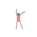
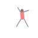
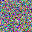
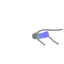

# FIGURE: Form, Invariance, and Geometric Understanding for Representation Evaluation

FIGURE is a synthetic dataset designed for studying **shape-based and motion-based representation learning** while controlling for **texture bias and global transformations**. Each sample in FIGURE is modeled as a **hierarchical kinematic structure**, where limbs are defined relative to a central **torso frame**. The dataset allows for controlled evaluations of robustness to **texture bias, global transformations, and motion dynamics**.  

Each sample is defined by a **set of relative limb frames**, describing the spatial relationships between body parts. In some variants, figures also undergo **global transformations**, where the entire body is placed within a world coordinate frame using SE(2) transformations. This enables experiments on **pose-invariant learning** while distinguishing between **relative shape structure and absolute world position**.  

FIGURE consists of two main tasks:  

1. **Shape Classification:** Figures are classified based on their **relative limb configurations** (e.g., arms up vs. arms down).  
2. **Motion Classification:** Figures are classified based on **sequences of shape frames evolving over time**, representing distinct motion patterns.  

To evaluate different aspects of representation learning, FIGURE includes the following sub-datasets:  

## Shape Classification  

**FIGURE-Shape-B**:    

The <ins>b</ins>ase **shape classification** dataset. Figures are classified based on their **shape**, which is defined by the arrangement of **limb frames** (e.g., arms up vs. arms down). There are no global transformations or color biases.

**FIGURE-Shape-CB**:     

A variant introducing a **<ins>c</ins>olor <ins>b</ins>ias** in training, where a specific class (e.g., arms-up figures) is more often associated with a particular shirt color. At test time, this correlation is inverted, allowing for an evaluation of **texture-invariant learning**.  

**FIGURE-Shape-PI**:    

A shape classification dataset with **global transformations**, where figures undergo **random translations and rotations** in SE(2). The relative limb frames remain unchanged, but the torso frame is placed randomly in the world frame. This tests **<ins>p</ins>ose-<ins>i</ins>nvariant learning**.  

**FIGURE-Shape-F**:    

The <ins>f</ins>ull set of variations by combination of **both color bias and global transformations**. This variant tests the ability to disentangle **shape, texture, and absolute position** when learning representations.  

### Some baseline results

Using the script ```experiments/train_figure_classifier_all_datasets.py``` you'll be able to genereate the reslults of training a resnet-18 on each of the datasets for various levels of ```color_consistency```, as given below. Note that for ```color_consistency=1.0``` the classes purely correlate with a predefined color (arms up always red), with ```color_consistency=0.8``` only 80\% of the time a class is rendered with the preferred color, and ```color_consistency=0.25``` essentially means a random color for every figure (since there are only 4 classes). In the colums labeled with "(OOD)" you'll find the results on the test set in which the color-class correlations are swapped (e.g. the up class now prefers yellow colors). A low performance on this set suggests overfitting to the shirt color.

| Consistency | B | CB | CB (OOD) | PI | F | F (OOD) |
|------------|----|----|----------|----|----|--------|
| 1.0 | 1.0000 | 1.0000 | 0.0000 | 0.9785 | 1.0000 | 0.0000 |
| 0.99 | 0.9998 | 0.9992 | 0.9798 | 0.9828 | 0.9898 | 0.0067 |
| 0.9 | 1.0000 | 0.9995 | 0.9985 | 0.9838 | 0.9798 | 0.8375 |
| 0.75 | 1.0000 | 0.9998 | 1.0000 | 0.9735 | 0.9845 | 0.9393 |
| 0.5 | 1.0000 | 0.9998 | 0.9992 | 0.9810 | 0.9820 | 0.9720 |
| 0.25 | 0.9995 | 0.9995 | 1.0000 | 0.9828 | 0.9805 | 0.9790 |

What we are seeing here is that as soon as the color bias is not perfect the resnet will pick up on other cues (such as the actual pose of the figure) to base the classification on. The most challenging dataset is F, which includes both color biases as well as random rotations and translations in the train and test sets.

## Generative modeling

I think all of us have been confronted with disturbing generated images with people with 3 arms and 6 or 7 fingers per hand. Similarly to the above described problem of texture bias, these artifacts are likely due to a lacking capability of generative models to represent geometric content. The FIGURE dataset provides a playground to address these problems in generative AI. For example, with ```experiments/train_figure_generator.py``` you can train a Flow Matching model on the figure dataset with the following results:

 

It indeed generates anatomically incorrect figures:




## Work in progress...

FIGURE provides a **controlled and flexible testbed** for studying **equivariance, invariance, and generalization** in deep learning models. Future extensions may introduce additional **motion complexity, 3D representations, and real-world domain adaptation**.  

## License  
This dataset is licensed under the **[CC BY 4.0 License](https://creativecommons.org/licenses/by/4.0/)**.  

## Citation  
If you use FIGURE in your research, please cite it as:  

```
@misc{figure2025, title={FIGURE: Form, Invariance, and Geometric Understanding for Representation Evaluation}, author={Erik J. Bekkers}, year={2025}, howpublished={\url{https://github.com/ebekkers/FIGURE}}, }
```
